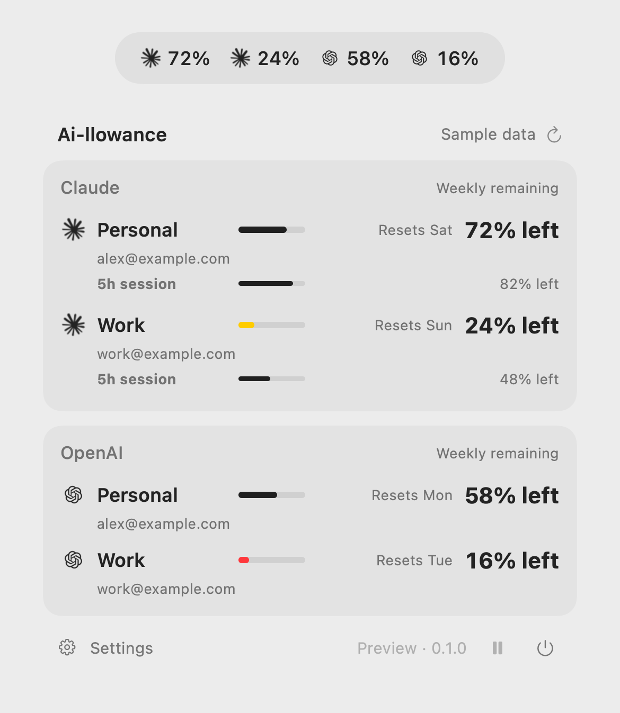

# Ai-llowance

*Know what’s left.*

A small native macOS menu bar app for multiple Claude and OpenAI accounts. SwiftUI + AppKit, Foundation networking, Security Keychain; no third-party runtime dependencies or Electron. Requires macOS 14+ and Swift 6 to build.

**0.1.0 preview — not a production release.** The download is for Apple Silicon Macs and is ad-hoc signed, not Developer ID signed or notarized. Claude's CLI usage format is version-dependent. See [verification](docs/verification.md) for tested behavior and remaining limits.

<picture>
  <source media="(prefers-color-scheme: dark)" srcset="docs/images/menu-dark.png">
  
</picture>

*Fictional accounts and readings. [Privacy policy](PRIVACY.md).*

## Install

1. Install [Claude Code](https://code.claude.com/docs/en/setup) and/or [Codex CLI](https://developers.openai.com/codex/cli) and keep the provider CLI up to date.
2. Download the [0.1.0 Apple Silicon preview](https://github.com/jamesatFRM/Ai-llowance/releases/tag/v0.1.0), or build from source below. Extract the ZIP and move **Ai-llowance.app** into **Applications**.
3. Open Ai-llowance. Its icon appears in the menu bar; **Settings** manages connections.

macOS may block the preview because it is not notarized. Review the source and release checksum before deciding whether to allow it through **System Settings → Privacy & Security → Open Anyway**. Follow [Apple's guidance](https://support.apple.com/102445); do not disable Gatekeeper globally. You can also build from source below.

The app targets macOS 14 or later. The downloadable binary is Apple Silicon only; Intel and all macOS versions have not been tested. No Apple developer membership is needed to build locally.

To check a download, place its `SHA256SUMS` file beside the ZIP and run `shasum -a 256 -c SHA256SUMS`. Updates are manual: quit Ai-llowance, replace the app, and reopen it. Account settings remain in Application Support. Login at startup is not enabled automatically.

## Connect once

Open **Accounts → Connect Claude** or **Connect OpenAI**.

- **Claude:** detects your existing Claude Code subscription sign-in. If needed, opens Claude's own browser login through a short Terminal launcher. Once sign-in completes, close Terminal: no conversation, test prompt, or persistent Terminal session is needed. Additional accounts use separate profiles.
- **OpenAI:** opens ChatGPT sign-in in your browser for a separate Codex profile. **More connection options → Use my existing OpenAI / Codex sign-in** connects the current CLI account instead.
- **API spending:** optional under **More connection options**. Requires an organization Admin API key stored in Keychain. Subscription login is separate from API billing.

The CLIs must be installed once; common installation locations are detected, with official installation links and file pickers when needed. Ai-llowance never downloads executables automatically.

## What the numbers mean

| Connection | Displays | Source |
|---|---|---|
| OpenAI Codex subscription | Weekly and session quota windows, plus weekly reset weekdays | Official local Codex app-server |
| Claude subscription | Weekly, five-hour, and any model-specific weekly limits returned | Installed Claude Code's built-in `/usage` command |
| OpenAI API | Organization costs this UTC month | Official Admin Costs API |
| Anthropic API | Organization costs this UTC month, excluding Priority Tier | Official Admin Cost Report API |

Percentages are explicitly labeled **left**. Each account has one prominent overall weekly reading with the reset weekday (for example, “Resets Wed”) and a smaller five-hour session reading underneath when available. Additional model-specific limits are in Settings. Bars use remaining allowance: white in dark mode (dark in light mode) at 30% or more, yellow above 20% and below 30%, red at 20% or less. Unavailable readings are gray. Each subscription account shows its signed-in email when available; the header has one refresh status for all accounts.

Choose Automatic, Light, or Dark appearance in Settings. Automatic follows macOS. Provider icons use native monochrome templates on transparent backgrounds.

The menu bar can show an average across all accounts, one average per provider, or individual accounts. Individual-account mode keeps Claude accounts together, followed by OpenAI accounts, preserving order within each provider. It can hide names for just provider icons and percentages; hover to identify accounts. Include all accounts or select specific ones. Averages give each account equal weight, regardless of plan size; they do not represent pooled credits. Only the overall weekly allowance is used in menu-bar summaries. Missing, failed, stale, or provider-restricted accounts make their group unavailable instead of being silently excluded.

Opening the menu or Settings requests a new reading, capped at one healthy network read per 30 seconds. Background polling runs about once a minute, independently of menu interaction, with provider backoff. Sleeping, pausing, and offline status stop network reads. Old/error readings are visibly marked; reset times never fabricate replenished quota. Clicking outside the menu dismisses it. Pause/resume and Quit are direct icon buttons.

Codex reports Codex's buckets, not a universal ChatGPT allowance. The Claude report is a direct plan-usage query, so usage elsewhere on that subscription can be reflected without another Claude Code conversation. It is still a point-in-time provider report, not a continuous live counter.

API spending is **not a remaining credit balance**. Claude API credits, Vercel Gateway credits, Gemini, and Grok are not supported in this preview. No balance is estimated from a spending total.

## Claude reliability and boundaries

Direct Claude usage was verified with **Claude Code 2.1.294** in local verification. Ai-llowance runs the exact built-in `/usage` command in print mode with safe mode, tools/MCP disabled, and session persistence disabled. The verified command returned **zero model turns and zero model cost**. Credentials stay inside Claude's own authentication system; no OAuth token extraction or private consumer API calls are implemented.

The JSON envelope is structured, but its plan rows are text. This is a version-dependent CLI integration, not a published external quota API. Ai-llowance accepts only recognized plan rows, requires a successful zero-turn/zero-cost report, excludes behavioral attribution percentages, rejects last-known/rate-limited reports as fresh data, and fails clearly if a CLI version changes the output. Update Claude Code if it does not return plan percentages in print mode.

The previous status-line bridge is no longer needed. After a successful direct read, the app restores the pre-Ai-llowance status line only if its own setting is still present. Later user edits survive. New connections do not change status-line settings.

## Security and footprint

See the [hardening and resource report](docs/hardening-and-resources.md) for measurements and verification limits. The native app is small, but short-lived provider CLIs add CPU and memory during refresh; “extremely lightweight” is not a claim about the entire process tree.

- One coalescible timer and serial reads. Claude and Codex run short-lived CLI children; there is no persistent background agent or inference loop.
- Network/API credentials are never logged. Claude's full local usage report stays in memory; only plan rows become app state. No transcript contents are read by Ai-llowance.
- API keys use this Mac's non-synchronizing Keychain. New Codex profiles require Keychain with no plaintext fallback.
- Claude owns its credentials. For new isolated Claude profiles, the login launcher detects Claude's possible plaintext fallback, logs out, removes that app-owned fallback, and stops until Keychain is available. Existing profiles retain Claude's credential-storage policy.
- API requests are GET-only to fixed official origins, with redirects rejected. Ai-llowance has no analytics, cookies, or backend service. Processes it launches disable supported Claude telemetry/error reporting and Codex analytics/feedback. Provider services still handle authentication and quota requests; see the [privacy policy](PRIVACY.md).
- Removing an app-owned OpenAI account logs it out. Claude sign-ins remain CLI-managed; use **More → Sign out in Terminal** before removal if desired.
- Dashboard links use your browser's current account, which may differ from the selected connection.

Local settings live under `~/Library/Application Support/UsageBar`. The original storage folder, bundle identity, and Keychain service are intentionally retained so existing accounts and preferences survive the rename. The development app is not App Sandbox enabled because it launches installed CLIs. Stable Developer ID signing is recommended before distribution.

## Build and test

```sh
bash scripts/test.sh
bash scripts/build-app.sh
open dist/Ai-llowance.app
```

The locally built `Ai-llowance.app` opens directly. Close Settings to keep it in the menu bar; the power icon quits the app. Preview fixtures never replace real account data:

```sh
# Quit any running Ai-llowance instance first.
open dist/Ai-llowance.app --args --preview
```

Export shareable PNGs with fictional emails and readings in both appearances (no live account data is loaded):

```sh
dist/Ai-llowance.app/Contents/MacOS/UsageBar --export-preview ./share-images
```

The export reuses the actual dashboard rows without its scroll container, which cannot be captured by SwiftUI's image renderer. The menu strip illustrates the same ordered entries as the native menu bar.

Optional isolated dummy-Keychain test:

```sh
USAGEBAR_TEST_KEYCHAIN=1 bash scripts/test.sh --filter keychainRoundTripWhenExplicitlyEnabled
```

Read-only live probes (use your installed CLI paths):

```sh
swift run UsageBridge --probe-codex /opt/homebrew/bin/codex
swift run UsageBridge --probe-claude "$HOME/.local/bin/claude"
```

`UsageCore` defines adapters, typed quota windows, timestamps, errors, polling policy, and credential storage. Future providers should expose only verified data, with explicit unsupported states. Google/Gemini and Grok are excluded following the narrowed scope; research is in [provider-research.md](docs/provider-research.md).


To produce an ad-hoc signed release ZIP and checksum:

```sh
bash scripts/package-release.sh
```

## Troubleshooting

- **No quota / sign-in needed:** use Accounts to sign in again. Subscription sign-in and API keys are different connection types.
- **Claude report not supported:** update Claude Code. The integration was verified with 2.1.294; older versions may not return subscription limits in print mode. Unsupported data remains unavailable.
- **Stale or rate-limited:** wait for provider backoff. Refresh intentionally cannot bypass a provider's wait instruction.
- **Wrong account on the website:** usage links open the browser's current account. Compare the email shown in Ai-llowance.
- **CLI not detected:** use More connection options to choose the executable. A custom executable choice currently lasts for that app launch.
- **Keychain locked:** unlock the login Keychain, then reconnect or refresh. Ai-llowance does not store API keys in plaintext.
- **Removing an account:** see [security and removal](SECURITY.md). Claude sign-ins are managed by Claude; removing the app alone does not sign them out.

Bug reports should include app/macOS/CLI versions and reproducible steps, with emails, keys, and account details removed. See [contributing](CONTRIBUTING.md) and [release notes](CHANGELOG.md).

## License and affiliation

[MIT](LICENSE). Ai-llowance is an independent project and is not affiliated with or endorsed by Anthropic or OpenAI. Provider names identify the services it connects to.

Provider logos belong to their respective owners and are excluded from the MIT license. See [third-party notices](THIRD_PARTY_NOTICES.md).

### Connection recovery

- A current signed-in Claude subscription can be reused. A logged-out or API-billed Claude CLI gets a separate subscription profile, leaving the original profile untouched.
- During sign-in the account says **Finish sign-in in your browser**. Claude completion is detected on the next local check (normally within 15 seconds), so it does not wait through an earlier authentication backoff. Unfinished Claude attempts stop waiting after ten minutes; close their Terminal window before retrying. Codex browser login can be cancelled in the app and times out after five minutes.
- Expired sign-ins show **Sign in** even if the last reading is still visible. Existing Codex CLI profiles are reauthenticated in Codex, then **Check sign-in** rereads them. Missing or unauthorized API credentials show **Replace key**.
- Duplicate emails are flagged for review instead of silently counting multiple connections to the same plan. A shared email can also belong to different organizations; the app does not automatically delete or merge those connections.
- Provider outages and rate limits retain their backoff. A late response from before a reconnect cannot replace the new connection state.
